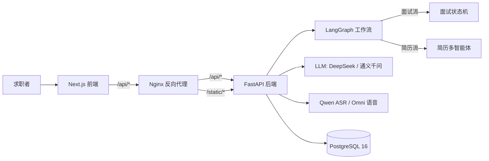

# 系统架构

职面 AI 是一个基于 LangGraph 的智能求职助手，包含模拟面试、能力评估、语音面试和简历工具四个核心能力。

## 总体架构

## 核心模块

| 模块 | 位置 | 职责 |
|---|---|---|
| FastAPI 路由 | backend/app/api | 认证、会话、聊天 SSE、上传、简历、报告、账号 |
| 面试状态机 | backend/app/core/graph.py | planner -> responder -> summary |
| 语音面试 | backend/app/core/voice_interview.py | ASR 转写、Omni 回复、SSE 流式 |
| 面试规划 | backend/app/core/interview_planner.py | 按简历/JD/轮次生成题目与提示 |
| 逐题评分 | backend/app/services/scoring_service.py | tech/expression/depth 三维评分 |
| 能力画像 | backend/app/services/ability_service.py | 六维能力与技能标签 |
| 简历分析 | backend/app/core/resume_analyzer_graph.py | 竞争力与画像分析 |
| 简历优化 | backend/app/core/resume_optimizer_graph.py | 圆桌多智能体 + 反思精炼 |
| 简历生成 | backend/app/core/resume_generation_graph.py | 需求分析、初稿、风控、终审 |
| 报告服务 | backend/app/services/report_service.py | Markdown + reportlab PDF |
| 安全 | backend/app/services/security.py | 限流、登录锁定 |
| 可观测 | backend/app/services/observability.py | JSON 日志、用量统计 |

## 面试流程

1. 用户注册/登录，上传简历并填写 JD。
2. POST /api/chat/start 初始化 LangGraph 状态，planner 生成面试计划。
3. 前端通过 SSE 接收逐题回复；每次回答由 followup_service 决定是否追问（最多 2 次）。
4. 题目完成后进入 summary，生成总结并触发能力画像分析。
5. 每题回答同步保存 answer_scores，供报告与画像使用。
6. 支持多轮面试：metadata 记录 round_index / parent_session_id，自动继承简历与 JD，避免重复出题。

## 简历优化流程

1. 上传 PDF/DOCX/TXT，解析为文本。
2. 竞争力分析：单模型输出评分、画像、趋势、建议。
3. 圆桌优化：匹配分析师、内容优化师、HR 审核官并行分析，主持人整合，反思节点检查，精炼节点二次优化。
4. 简历生成：需求分析 -> 初稿 -> 初稿优化 -> 风控核查 -> 终审润色，严格保留上传简历排版。

## 数据模型

核心表：users、sms_codes、login_attempts、sessions、messages、interview_plans、answer_scores、ability_profiles、user_profile、resume_results、generated_resumes、usage_logs。

## 部署架构

- Docker Compose 编排 postgres / backend / frontend / nginx。
- Nginx 统一 80/443 入口，按子域名分流 interview 与 travel 两个项目。
- Let's Encrypt 证书每日自动续期。
- 详见 [DEPLOYMENT.md](DEPLOYMENT.md)。